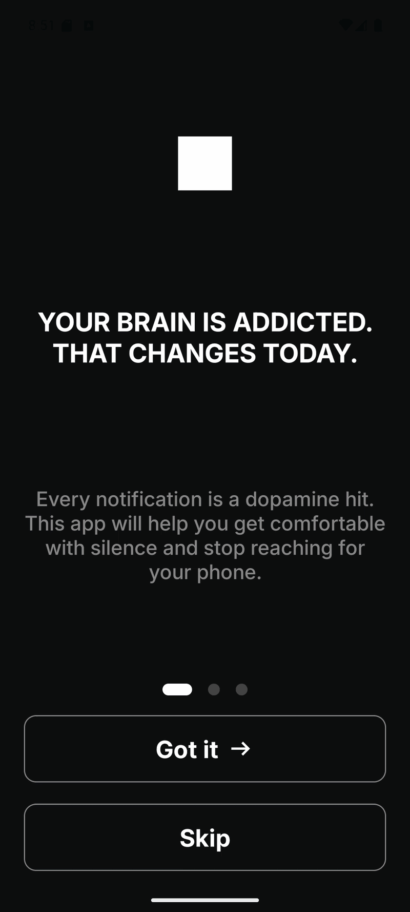
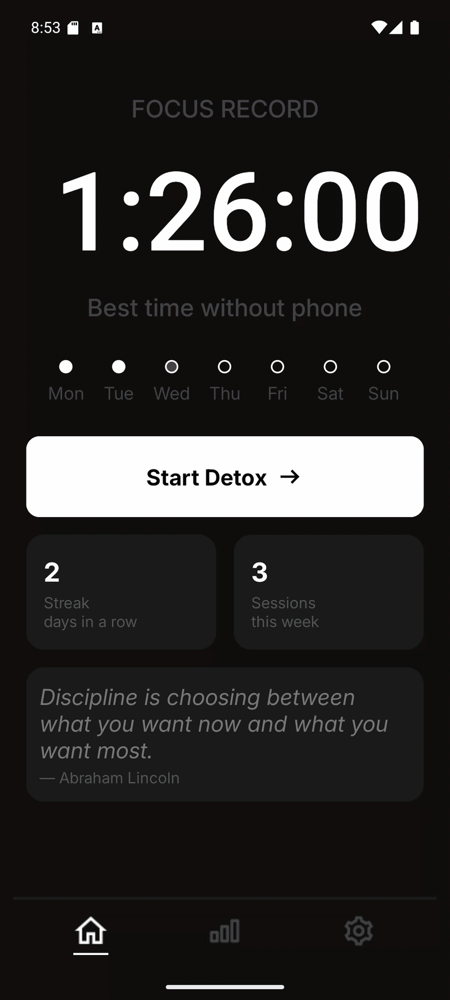
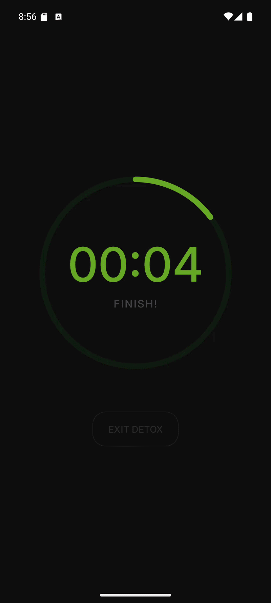
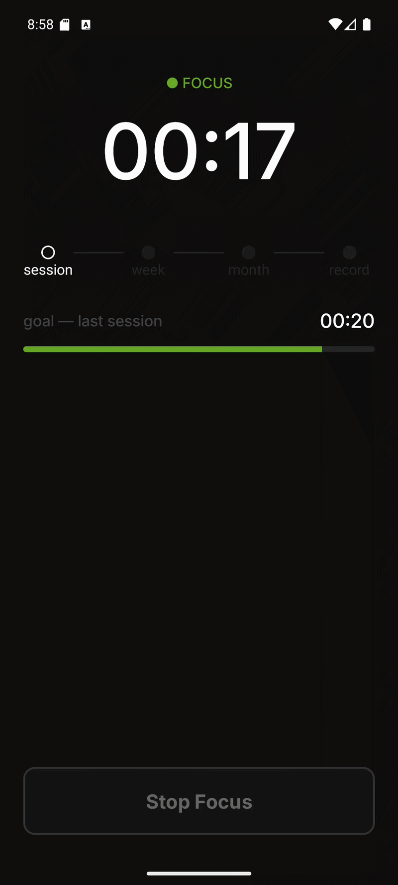
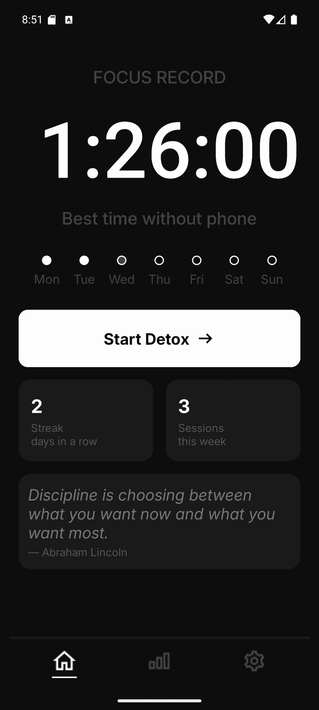
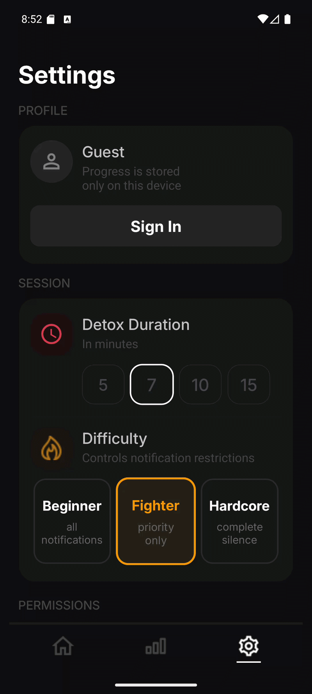

# BoredomFocus

> **A dopamine detox app for Android.** Sit in silence. Train your focus. Track your progress.

<br>

## Demo

<table>
  <tr>
    <td align="center"><b>Onboarding & Home</b></td>
    <td align="center"><b>Start Session</b></td>
    <td align="center"><b>Detox Timer</b></td>
  </tr>
  <tr>
    <td>
      
    </td>
    <td>
      
    </td>
    <td>
      
    </td>
  </tr>
  <tr>
    <td align="center"><b>Focus Stopwatch</b></td>
    <td align="center"><b>Statistics</b></td>
    <td align="center"><b>Settings</b></td>
  </tr>
  <tr>
    <td>
      
    </td>
    <td>
      
    </td>
    <td>
      
    </td>
  </tr>
</table>

<br>

## What is BoredomFocus?

Most productivity apps tell you to work harder. BoredomFocus does the opposite — it asks you to **do nothing**.

A **detox session** forces you to sit quietly for a set duration with notifications blocked. When it ends, a **focus stopwatch** starts. The goal: see how long you can stay present before reaching for your phone.

Your focus time is tracked, compared to previous sessions, and visualized over time.

<br>

## Features

### Session Flow
- **Detox Timer** — countdown with a circular ring (5, 7, 10, or 15 minutes)
- **Focus Stopwatch** — starts automatically after detox, tracks how long you resist distractions
- **Session Types** — full session (detox + focus) or focus-only mode
- **Session Result** — shows focus time, milestones hit, streak, and confetti for new records

### Difficulty Levels & DND
| Level | During Detox | During Focus |
|-------|-------------|--------------|
| **Beginner** | DND off | DND off |
| **Fighter** | DND Priority | DND Priority |
| **Hardcore** | DND None (total silence) | DND Priority |

### Milestone System
Focus sessions track progressive goals in order: beat your last session → beat weekly best → beat monthly best → beat all-time record. Each milestone triggers haptic feedback and a visual celebration.

### Statistics
- **Filters:** Week / Month / All Time
- **Metrics:** focus record, average focus, session count, detox completion rate, total focus time
- **Smart deltas:** compares to the previous period with context-aware messages (new period, big drop, first week, etc.)
- **Bar chart:** detox and focus bars per day/week/month — tappable for session details
- **Session history:** grouped by date, with visual bars for each session type

### Settings
- Default session duration and difficulty
- Do Not Disturb permission management
- Daily reminder with custom time
- Language selector (English / Russian)
- Firebase Auth: sign in with Google or Email/Password

### Onboarding
Three-screen onboarding shown on first launch: welcome, session setup, and permission requests.

<br>

## Tech Stack

| Layer | Technology |
|-------|-----------|
| Language | Kotlin |
| Architecture | MVVM + Repository Pattern + Clean Architecture |
| UI | XML Views, ViewBinding, Custom Views |
| Navigation | Navigation Component + SafeArgs |
| DI | Hilt (Dagger 2) |
| Local Storage | Room (SQLite) |
| Async | Kotlin Coroutines, Flow, StateFlow |
| Preferences | DataStore Preferences |
| Auth | Firebase Authentication |
| Background | ForegroundService (session timer) |
| Notifications | WorkManager + NotificationManager |
| DND | NotificationManager Policy API |

<br>

## Architecture

The project follows **Clean Architecture** with feature-based modularization:

```
boredomfocus/
├── app/                        # Application entry point
├── core/
│   ├── di/                     # Hilt modules
│   ├── notification/           # Reminder scheduling, channels
│   ├── permission/             # DnD & notification permission handling
│   ├── preferences/            # AppSettings via DataStore
│   └── ui/                     # Custom views & reusable components
│       ├── CircularProgressView
│       ├── DetoxFocusChartView
│       ├── SessionBarsView
│       └── CustomToggleSwitch
├── data/
│   ├── local/                  # Room database, DAOs, entities
│   └── repository/             # Repository implementations
├── domain/
│   ├── model/                  # Business models
│   └── repository/             # Repository interfaces
└── feature/
    ├── auth/                   # Sign in / Sign up dialogs
    ├── focussession/           # Detox timer, focus stopwatch, results
    │   └── service/            # FocusSessionService (ForegroundService)
    ├── home/                   # Home screen
    ├── onboarding/             # First-launch onboarding
    ├── sessionsettings/        # Session config bottom sheet
    ├── settings/               # Settings screen
    └── statistics/             # Stats screen with chart & history
```

<br>

## Key Technical Decisions

**ForegroundService for the timer** — `FocusSessionService` runs as a foreground service so the session continues when the app is backgrounded. The Fragment binds to it via `ServiceConnection` and observes `StateFlow<FocusSessionUiState>`.

**DND management** — `DndManager` stores the user's previous interruption filter before overriding it, then restores it when the session ends. Handled in `onDestroy` as a safety net if the service is killed.

**Timezone-safe statistics** — all sessions are stored as `epochMillis` (UTC). Grouping by calendar day uses `Instant.ofEpochMilli(date).atZone(ZoneId.systemDefault()).toLocalDate()` in Kotlin — never dividing by `86_400_000` in SQL.

**Smart delta logic** — `StatisticsViewModel` evaluates each metric card through a priority chain: `firstPeriod → noData → periodJustStarted → stable → bigDrop (>35%) → allTimeBest → up/down`, showing context-aware messages instead of always showing red/green deltas.

**Session types** — `SessionEntity` has an `isFocusOnly` flag and `detoxCompleted` boolean. The statistics screen renders four distinct row layouts depending on the combination.

<br>

## Getting Started

1. Clone the repository
```bash
git clone https://github.com/bekaretzkaa/boredomfocus.git
```

2. Add your `google-services.json` to the `app/` directory (Firebase project required for Auth)

3. Build and run
```bash
./gradlew assembleDebug
```

> Minimum SDK: 26 (Android 8.0)  
> Target SDK: 34 (Android 14)

<br>

## License

```
MIT License — feel free to use this project for learning or inspiration.
```
